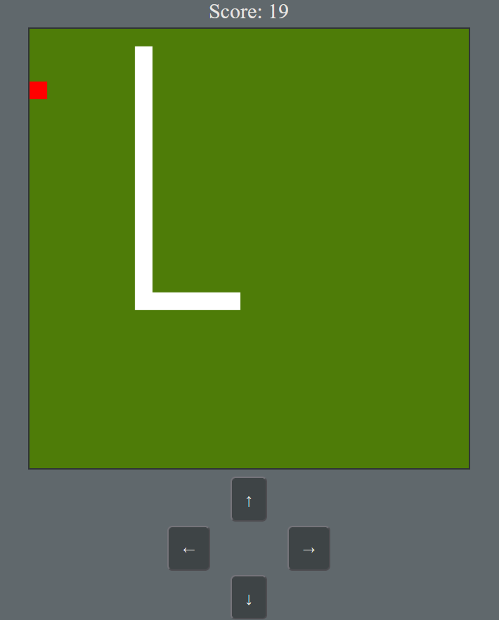

# Snake Game Overview

The snake game operates by rendering a **canvas**, the **snake segments**, and the **apple** with each new frame, ensuring smooth gameplay and updated visuals.

---

## The Snake

- **Segment Size**: The snake has a `size` variable that defines the pixel dimensions of each side of its segments. This determines how large each block of the snake appears on the canvas.

- **Movement Logic**: 
  - The snake's movement is controlled by an object containing functions for each direction (up, down, left, right). 
  - These functions modify a `movement` variable, which serves as an offset to calculate the snake's next position on the canvas.
  - With every frame, the snake’s position is updated based on this offset, ensuring fluid movement.

---

## The Apple

- **Random Placement**: 
  - The apple is placed at a random location on the canvas when the game begins and every time it **collides with the snake's head**.
  
- **Static Behavior**: 
  - Once placed, the apple remains stationary until the snake collects it by overlapping its head with the apple's position.

---

## The Score

- **Increment**: 
  - Each time the snake collects an apple, the score increases by `1`. This reflects the player’s progress in the game.

- **Reset on Death**: 
  - If the snake dies (e.g., collides with itself or the canvas boundaries), the score resets to `0`, encouraging the player to try again for a higher score.

---
